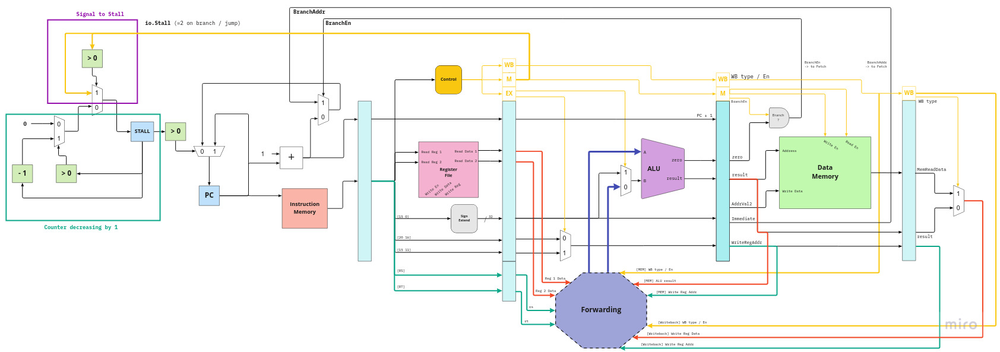

# Mintel

Mintel is a 5-stage pipelined RISC microprocessor written in Scala using Chisel. It has a data forwarding system to prevent data dependencies and a stall system when a branch / jump instruction is detected.

Stages: Fetch, Decode, Execute, Memory, Writeback.

## Datapath

- More on Chisel: https://www.chisel-lang.org/
